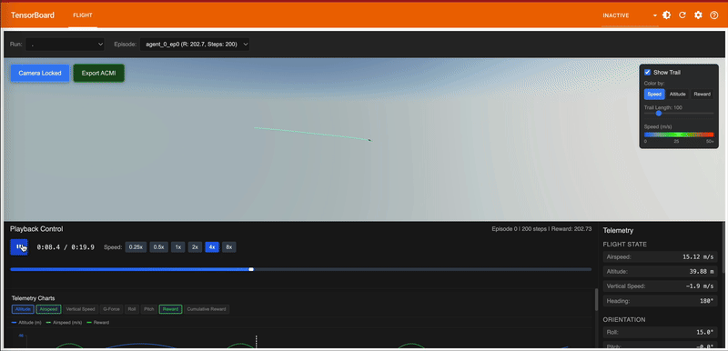

# TensorBoard Flight Visualization Plugin

A TensorBoard plugin for visualizing and analyzing flight trajectories from reinforcement learning agents. Inspired by Tacview, this plugin provides 3D visualization, telemetry analysis, and multi-agent comparison tools specifically designed for flight control RL research.

## Features

- **3D Flight Visualization**: Interactive Three.js-based 3D viewer with multiple camera modes
- **Telemetry Analysis**: Real-time display of flight parameters and RL metrics
- **Multi-Agent Comparison**: Compare multiple agents/policies side-by-side
- **Training Evolution**: Visualize how flight behavior improves over training
- **Time Series Charts**: Plot any telemetry or RL metric over time
- **Event Tracking**: Mark and analyze critical events (crashes, checkpoints, etc.)

## Demo



## Status

**Current Phase**: Phase 2 Complete ✅
**Version**: 0.1.0-alpha
**Ready For**: Testing and feedback

- ✅ **Phase 1 Complete**: Core logging infrastructure, data schemas, SB3 integration, ACMI support
- ✅ **Phase 2 Complete**: 3D visualization frontend with Three.js, telemetry panel, timeline controls
- 🔄 **Phase 3 In Progress**: Time series charts and advanced telemetry analysis

See [DESIGN_PLAN.md](docs/DESIGN_PLAN.md) for the complete design document and implementation roadmap.

## Architecture

```
Training Env → FlightLogger → TensorBoard → Plugin Backend → React Frontend
                                                              ↓
                                                    3D Viewer + Charts
```

## Quick Start

### Installation

```bash
# From source (PyPI package coming soon)
git clone https://github.com/lhwright13/tensorboard-flight-plugin.git
cd tensorboard-flight-plugin
pip install -e .
```

### Try the Demo

The repository includes a pre-generated dogfight demo with two aircraft engaged in pursuit/evasion:

```bash
tensorboard --logdir example_data/dogfight
# Open http://localhost:6006 → Flight tab → Select both runs
```

See [examples/README.md](examples/README.md) for more demos and usage examples.

### Basic Usage

```python
from tensorboard_flight import FlightLogger

# Create logger
logger = FlightLogger(log_dir="runs/experiment_1")

# Start episode
logger.start_episode(agent_id="ppo_agent")

# Log flight data during your training loop
for step in range(1000):
    logger.log_flight_data(
        step=step,
        agent_id="ppo_agent",
        position=(x, y, z),              # Position in meters
        orientation=(roll, pitch, yaw),  # Euler angles in radians
        velocity=(vx, vy, vz),           # Velocity in m/s
        telemetry={
            'airspeed': 50.0,
            'altitude': 100.0,
            # ... other telemetry
        },
        rl_metrics={
            'reward': reward,
            'action': action,
            'value': value,
        }
    )

# End episode
logger.end_episode(success=True)
```

View in TensorBoard:
```bash
tensorboard --logdir runs/
# Navigate to the "Flight" tab
```

### ACMI Export (Tacview Compatible)

```python
from tensorboard_flight.acmi import ACMILogger

# Drop-in replacement with automatic ACMI export
logger = ACMILogger(
    log_dir="runs/training",
    enable_acmi_export=True,
    acmi_export_interval=10  # Export every 10th episode
)

# Use exactly like FlightLogger
# ACMI files automatically created in runs/training/acmi/
# Open .txt.acmi files in Tacview for professional flight analysis!
```

## Development Roadmap

- [x] **Phase 1: Foundation** - Core logging infrastructure, data schemas, SB3 integration, ACMI support
- [x] **Phase 2: 3D Visualization** - Three.js viewer, telemetry panel, timeline controls
- [ ] **Phase 3: Telemetry & Charts** - Time series plotting, advanced telemetry analysis
- [ ] **Phase 4: Multi-Agent Comparison** - Side-by-side agent comparison tools
- [ ] **Phase 5: RL-Specific Features** - Training evolution visualization, policy comparison
- [ ] **Phase 6: Polish & Documentation** - Comprehensive docs, examples, PyPI release

## Documentation

- [Design Plan](docs/DESIGN_PLAN.md) - Comprehensive design document with architecture, data models, and implementation plan
- [ACMI Support](docs/ACMI_SUPPORT.md) - Complete guide to ACMI format integration and Tacview compatibility
- [Testing Guide](TESTING.md) - How to test the plugin frontend and backend
- [Examples](examples/) - Working code examples for basic usage and ACMI integration

## Key Features

### ✅ Implemented (Phase 1-2)

- **FlightLogger API** - Simple, intuitive logging of flight trajectories
- **Data Schemas** - Well-defined data structures for episodes, telemetry, and RL metrics
- **ACMI Import/Export** - Full bidirectional Tacview compatibility with CAM extensions
- **3D Visualization** - Interactive Three.js-based flight viewer
- **Telemetry Display** - Real-time display of all flight parameters
- **Timeline Controls** - Play/pause, speed control, time scrubbing
- **Stable-Baselines3 Integration** - Callbacks for seamless SB3 integration
- **Comprehensive Tests** - 8 test modules covering core functionality

### 🔄 In Development (Phase 3+)

- Time series charts for telemetry analysis
- Multi-agent comparison views
- Training evolution visualization
- Policy comparison tools

## License

MIT License - see [LICENSE](LICENSE) file for details.

## Contributing

Contributions welcome! This project is in active development (Phase 2 complete, Phase 3 in progress).

**To contribute:**
1. Fork the repository
2. Create a feature branch
3. Make your changes with tests
4. Submit a pull request

See the [Issues](https://github.com/lhwright13/tensorboard-flight-plugin/issues) page for planned features and known bugs.

## Author

**Lucas Wright** - [lhwright13](https://github.com/lhwright13)

## Acknowledgments

- Inspired by [Tacview](https://www.tacview.net/) for flight analysis visualization
- Built on [TensorBoard](https://www.tensorflow.org/tensorboard) plugin architecture
- Uses [Three.js](https://threejs.org/) for 3D rendering
